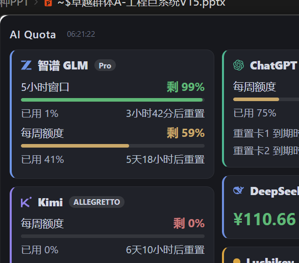

# AI Quota Desk

A native desktop widget (always-on-top floating window) that shows **remaining quota across five AI coding plans at a glance** — GLM Coding Plan, Kimi for Coding, ChatGPT (Codex), DeepSeek balance, and sub2api-style relay balance.



Built with **Tauri 2 + Rust + TypeScript**. Single lightweight binary, no Electron.

## Features

- **Floating always-on-top window** — frameless, draggable, collapsible to system tray; resizable with a two-column masonry layout and a layered dark theme
- **Per-provider cards** with brand logos, plan badges (e.g. *Pro*, *Allegretto*), progress bars colored by remaining quota (green / amber / red), usage details, and precise reset countdowns ("3h42m before reset", reset-credit expiry timestamps down to the minute)
- **Auto refresh** on a configurable interval; unified "last updated" timestamp in the title bar
- **Zero-prompt credentials**: auto-detects GLM keys from local ZCode/Claude configs, reads Codex OAuth from `~/.codex/auth.json` (with automatic token refresh written back safely), and reuses the Kimi desktop app's login state when available

## Supported providers & data sources

| Provider | Endpoint | Auth |
|---|---|---|
| 智谱 GLM Coding Plan | `GET {base}/api/monitor/usage/quota/limit` | API key (auto-detected from ZCode / Claude Code config, or manual) |
| Kimi for Coding | `GET api.kimi.com/coding/v1/usages` + membership APIs | **Device-code OAuth** (self-refreshing), or API key, or desktop-app login state, or manual web token |
| ChatGPT (Codex) | `GET chatgpt.com/backend-api/wham/usage` (+ `wham/rate-limit-reset-credits`) | OAuth from `~/.codex/auth.json`, auto refresh with mtime-guarded write-back |
| DeepSeek | `GET api.deepseek.com/user/balance` | API key |
| sub2api relays (e.g. Luchikey) | `GET {base}/v1/usage` | API key |

### Kimi device-code login

Kimi's OAuth implementation (`packages/oauth` in the official `MoonshotAI/kimi-code` repo) supports the standard RFC 8628 device flow against `auth.kimi.com`. This app implements it natively:

1. Click **Login Kimi** in Settings — a user code is copied and the authorization page opens in your browser
2. Approve the request
3. Done — the app holds a long-lived refresh token and **silently rotates its own access tokens** (15-min TTL) from then on. No dependency on the Kimi desktop app running, no cookie re-copying.

Refresh tokens are rotated per the spec and persisted to `%APPDATA%\ai-quota-desk\kimi-oauth.json`.

## Build

Prerequisites: [Rust](https://rustup.rs) (MSVC toolchain on Windows), Node.js 18+, and the [WebView2 runtime](https://developer.microsoft.com/microsoft-edge/webview2/) (preinstalled on Windows 11).

```bash
npm install
npm run tauri dev     # develop
npm run tauri build   # bundle installer (NSIS)
npm run tauri build -- --no-bundle   # standalone exe only
```

Output binary: `src-tauri/target/release/ai-quota-desk.exe`

Configuration lives in `%APPDATA%/ai-quota-desk/config.json` — API keys can also be entered in the in-app Settings page.

## Implementation notes

- **Window labels are inferred from reset countdowns** rather than vendor enums — e.g. Zhipu's `unit/number` fields are unreliable across plan generations (a weekly window was once misread as monthly); time-to-reset is the ground truth (<6.5h → 5-hour window, <8d → weekly, …).
- **Codex token refresh is write-safe**: the refresh flow captures `auth.json`'s mtime before reading and aborts the write-back if the file changed, so it never clobbers a concurrently-rotated token from the official Codex CLI.
- Reference implementations this project learned from:
  - [zai-org/zai-coding-plugins](https://github.com/zai-org/zai-coding-plugins) — official GLM usage endpoints
  - [steipete/CodexBar](https://github.com/steipete/CodexBar) (`docs/codex.md`, `docs/kimi.md`, `Sources/CodexBarCore/Providers/Kimi`) — field mappings, Kimi web-fallback APIs, membership pool
  - [Mai0313/VibeCodingTracker](https://github.com/Mai0313/VibeCodingTracker) (`src/core/src/quota/wham.rs`) — Codex wham/usage + refresh flow
  - [VicBilibily/GCMP](https://github.com/VicBilibily/GCMP) — Kimi usage response parsing
  - [MoonshotAI/kimi-code](https://github.com/MoonshotAI/kimi-code) (`packages/oauth`) — device-code flow and refresh semantics
  - [Wei-Shaw/sub2api](https://github.com/Wei-Shaw/sub2api) — relay usage endpoint
  - [borawong/AiMaMi](https://github.com/borawong/AiMaMi) — inspiration for the Tauri desktop-companion form factor

## License

MIT
