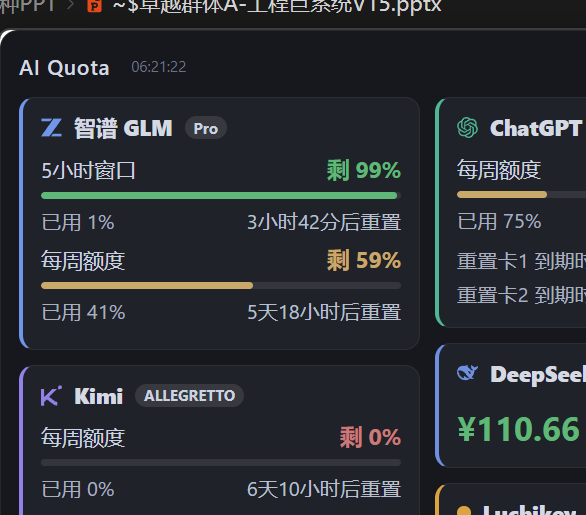

# AI Quota Desk


A native **always-on-top desktop widget** that shows the remaining quota of your AI coding plans at a glance — five providers on one floating card, auto-refreshing in the background.

<p align="center">
  
</p>

## Supported providers

| Provider | What you see | Credential |
|---|---|---|
| **智谱 GLM Coding Plan** | 5-hour window, weekly quota, reset credits (with expiry timestamps) | API key — auto-detected from ZCode / Claude Code config, or manual |
| **Kimi for Coding** | Weekly quota, 5-hour window, monthly pool, plan tier, booster wallet | **Device-code OAuth** (self-refreshing) · API key · desktop-app login state · manual web token |
| **ChatGPT (Codex)** | Weekly/5-hour windows, reset credits with expiry | OAuth from `~/.codex/auth.json` — **multi-account** via AiMaMi-compatible registry |
| **DeepSeek** | Account balance | API key |
| **sub2api relays** (Luchikey etc.) | Remaining balance | API key |

## Highlights

- **One floating card for everything.** Frameless always-on-top window, draggable, collapses to the system tray. Two-column masonry layout with a layered dark theme; every card carries brand logos, plan badges and progress bars that turn amber → red as quota drains.
- **Reset info you can act on.** Reset countdowns are precise to the minute ("3h42m before reset"), and both ChatGPT and GLM reset credits are listed individually with their expiry dates — so you know *when* to burn them before they vanish.
- **Multi-account ChatGPT.** If you use [AiMaMi](https://github.com/borawong/AiMaMi) to manage several Codex accounts, every account gets its own card automatically (read from `~/.codex/accounts/registry.json`), each refreshing its own tokens independently.
- **Kimi login that stays logged in.** Implements the standard device-code flow (`RFC 8628`) against `auth.kimi.com`, exactly like the official `kimi-code` CLI. Approve once in the browser; the app then rotates its own access tokens forever. No cookies to re-copy, no desktop app to keep running.
- **Zero-prompt credential detection.** GLM keys are picked up from existing ZCode / Claude Code configs; Codex tokens from the official `auth.json`. Nothing is ever sent anywhere except the vendor's own API.

## Install & build

Prerequisites: [Rust](https://rustup.rs) (MSVC toolchain on Windows), Node.js 18+, WebView2 runtime (preinstalled on Windows 11).

```bash
git clone https://github.com/Yu-tao-Li/ai-quota-desk.git
cd ai-quota-desk
npm install
npm run tauri dev                  # develop
npm run tauri build                # NSIS installer
npm run tauri build -- --no-bundle # standalone exe
```

Binary output: `src-tauri/target/release/ai-quota-desk.exe` — run it, then right-click the tray icon for options. Credentials can be entered in the in-app ⚙ settings; they are stored locally in `%APPDATA%/ai-quota-desk/` and never leave your machine.

## Notes on the trickier integrations

These are documented for anyone building something similar:

- **GLM reset credits** live on a ZCode-internal endpoint (`zcode.z.ai/api/v1/coding-plan/reset/status`) that requires two credentials from ZCode's AES-256-GCM-encrypted credential store. The store's key-derivation string must match Node's `process.platform` (`win32`), not Rust's `std::env::consts::OS` (`windows`) — a one-character mismatch silently breaks decryption. See `src-tauri/src/zcode_creds.rs`.
- **GLM window classification** should use the `unit` field (`3` → 5-hour window, `6` → weekly), not reset-time ordering — near the end of a weekly cycle the weekly window resets *earlier* than the 5-hour one and time-sorting mislabels the two.
- **Codex token refresh writes back safely**: the refresh flow captures the credential file's mtime first and aborts the write-back if it changed, so it never clobbers a token rotated concurrently by the Codex CLI or AiMaMi.
- **Kimi's two API planes don't mix**: `api.kimi.com/coding/v1` accepts the CLI/OAuth identity, while `www.kimi.com/apiv2` (monthly pool, plan title) only accepts web-session cookies. Query each credential against the plane it belongs to.

## Credits & references

Standing on the shoulders of:

- [zai-org/zai-coding-plugins](https://github.com/zai-org/zai-coding-plugins) — official GLM usage endpoints
- [steipete/CodexBar](https://github.com/steipete/CodexBar) — Codex field mappings, Kimi web fallback APIs
- [Mai0313/VibeCodingTracker](https://github.com/Mai0313/VibeCodingTracker) — Codex `wham/usage` + refresh flow
- [MoonshotAI/kimi-code](https://github.com/MoonshotAI/kimi-code) (`packages/oauth`) — device-code flow and refresh semantics
- [VicBilibily/GCMP](https://github.com/VicBilibily/GCMP) — Kimi usage response parsing
- [Wei-Shaw/sub2api](https://github.com/Wei-Shaw/sub2api) — relay usage endpoint
- [borawong/AiMaMi](https://github.com/borawong/AiMaMi) — multi-account registry format & the desktop-companion idea

## License

[MIT](LICENSE)
